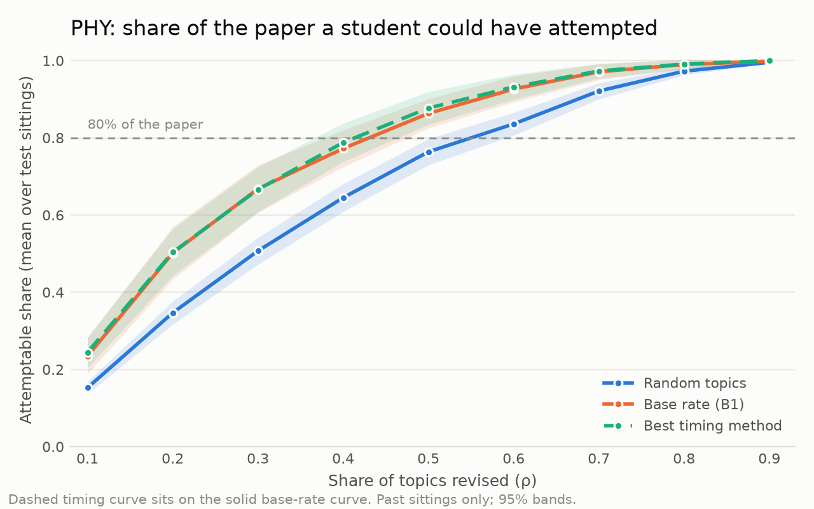

# Leaving Certificate past papers: what is actually predictable

A retrospective study of Irish Leaving Certificate Higher Level papers — Physics 2002–2026 and
Mathematics 2012–2026 — asking one question:

> If a student revises only some of the syllabus topics, how much of a past paper could they have attempted?

And, more pointedly: does it help to know **which topics come up often**, and does it help on top of that to guess
**which topic is "due"** because it has not appeared for a few years?

**Retrospective analysis of past papers only. It makes no prediction about any future examination.**

**[Read it as an interactive page →](https://aijcoder.github.io/leaving-cert-predictability/)** · [Wiki, written for students](https://github.com/Aijcoder/leaving-cert-predictability/wiki)

## The finding

Knowing the frequencies helps. Guessing the rotation does not.

At ρ = 0.5 — half the topics revised — averaged over the test sittings:

| | Physics | Maths |
|---|---|---|
| Topics chosen at random | 76% | 58% |
| Topics chosen by past frequency | 86% | 71% |
| Frequency plus timing patterns | 88% | 71% |

Decomposed, where that share comes from:

| Source | Physics | Maths | Significant? |
|---|---|---|---|
| The paper's own choice rules | +19.5 pts | +7.3 pts | — |
| Topic frequency | +8.7 pts | +9.8 pts | **yes**, Holm p = 0.0015 |
| Timing / gap patterns | +0.6 pts | −0.0 pts | no, Holm p = 0.064 |

The timing gain falls inside the ±5 point equivalence margin that was fixed in advance, for both subjects, and
survives every sensitivity analysis (strict credit, three appearance thresholds, excluding 2020–2022, collapsing
the codebook to top-level strands). "Topic X hasn't come up in three years, so it's due" does not hold up on
twenty-five years of Physics papers.



Full results: [`reports/analysis_report.md`](reports/analysis_report.md).

## How it was measured

1. **Structure.** 74 papers split into 3,549 leaf parts — the smallest piece with its own marks — with the
   marking scheme's marks attached and the paper's choice rules ("answer any five of…") parsed into a tree, so a
   score reflects what a student could actually skip. All 74 papers reconcile against their printed totals.
2. **Codebooks.** Topic lists built from the syllabus headings: 38 topics for Physics, 25 for Maths, 23 for
   Applied Maths, frozen with a hash before any labelling.
3. **Labels.** Each leaf's scoring steps were mapped to syllabus topics, giving whole-ten weights that sum to 100
   per part. 3,546 of 3,549 leaves got a valid label.
4. **Evaluation.** A rolling origin: for each test sitting, methods see only earlier sittings. Six methods —
   random, base rate, two recency rules, two regressions. Leakage is enforced in code, not by convention: a method
   that reads a sitting at or after its target raises an error.
5. **Controls before results.** The analysis plan was written and hashed before any real-data result
   (`data/analysis/plan.lock` verifies `data/analysis/plan.md`). The whole engine was then run 4,000 times on
   synthetic papers with a known truth: it must report a false signal 2–8% of the time when there is none, and
   find a real one at least 80% of the time when there is. Only after those controls passed was it run on the real
   papers. See [`reports/simulator_controls.md`](reports/simulator_controls.md).

Those controls rejected two real defects before any result existed: a bootstrap interval that under-covered when a
subject has few test sittings, and synthetic papers whose topic structure did not match the real ones.

## What is in here

| Path | |
|---|---|
| `reports/` | the analysis report, simulator controls, label QA, coverage and structure reports |
| `figures/` | the four figures |
| `data/stats/` | topic × sitting and per-topic history tables (CSV) |
| `data/codebooks/` | the frozen topic codebooks |
| `data/analysis/` | the locked plan and its hash, results, AS curves |
| `src/lcbank/` | the pipeline: extraction, structure, codebooks, labelling, QA, analysis, exports |

## What is not in here, and why

- **No exam text, no marking-scheme text, no page images.** The papers and marking schemes are published by the
  State Examinations Commission for personal study. Nothing in this repository reproduces them: it holds
  statistics, topic labels and code. To read a question, use the SEC's own archive.
- **No question-level dataset.** The per-part table (item ids, marks, topic labels) is derived metadata, but
  publishing a derived database of someone else's material is a permission question that has not been settled, so
  it stays out until it is.
- **No downloader.** The pipeline starts from PDFs already on disk. A ready-made scraper for the exam archive is
  not something to hand out, and it is not needed to check any of this — the papers are a few clicks away on the
  SEC site.

## Reproducing it

```bash
pip install -r requirements.txt
# put the exam PDFs under data_private/raw/ (see config/datasets.yaml for the naming)
python -m lcbank.run --list          # the phases and their commands
python -m lcbank.run --phases 2,3,4  # extract, structure, codebooks
python -m lcbank.run --phases 7,8    # tables, then simulator controls and the analysis
```

Labelling (phase 5) needs an OpenAI-compatible endpoint; see `.env.example`.

## Method note

The topic labels for all 3,549 parts were produced by a language model
(`deepseek-v4-1-flash-260910`) reading each part together with its marking-scheme steps; the weights are computed
in code from the marks the scheme awards, not chosen by the model. Label stability was measured by relabelling a
stratified 10% sample and comparing: weight overlap 0.91–0.99 and main-topic agreement 0.91–1.00 across the four
datasets ([`reports/label_qa.md`](reports/label_qa.md)). The labels have not been checked against a human's
judgement on a blind sample.

## Caveats

- Only the Physics hypothesis tests are confirmatory. Maths is exploratory by design — it has 8 test sittings
  against Physics's 17 — and every sensitivity analysis is exploratory.
- Applied Maths (4 sittings) and the 2012–13 transitional Maths papers are described in the tables but never
  analysed: too few sittings for a rolling origin.
- Confidence intervals use a t interval on the bootstrap standard error rather than the percentile interval the
  plan originally specified; the percentile version under-covered badly at 8 test sittings, which the simulator
  caught. That change came after the plan was locked, so every interval here is exploratory. The permutation
  p-values do not use the bootstrap and are unaffected.
- The 2020 papers' month (June, or the rescheduled November sitting) could not be determined from the documents.

## Licence

Code and the written reports: MIT (see `LICENSE`). The underlying examination papers and marking schemes remain
the copyright of the State Examinations Commission and are not redistributed here.
